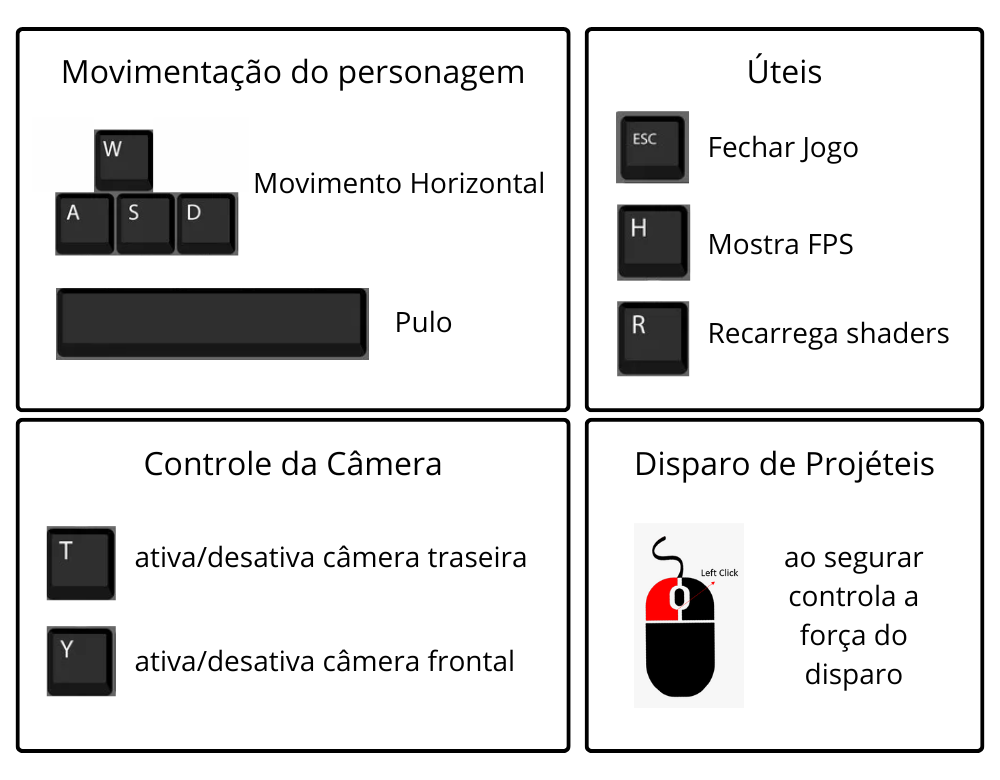
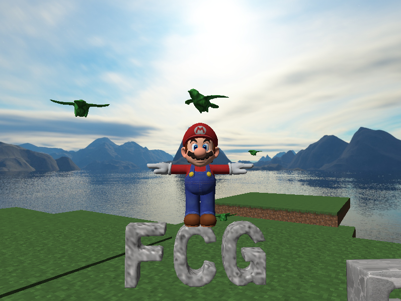
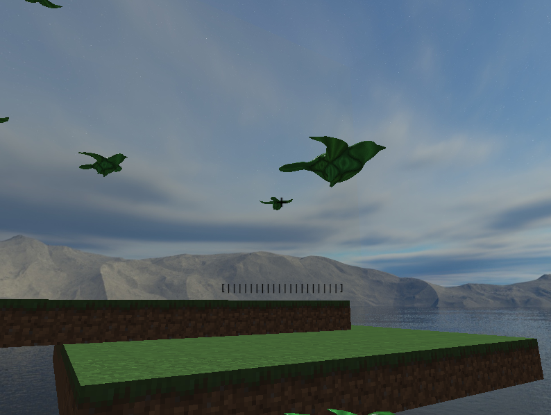

# INF01047-Trabalho-Final

Requisitos

    O trabalho deve ser desenvolvido em duplas.
        Parte da entrega do trabalho final de FCG será através do Git (hosting no Github). Assim, o professor poderá colaborar através de revisão de código (dado um commit específico), pull requests, etc., caso a dupla precise de alguma ajuda durante o desenvolvimento do trabalho.
        Até o dia 3 de outubro de 2025, preencha o formulário do link abaixo informando os integrantes de sua dupla e uma breve descrição de qual será a aplicação gráfica desenvolvida, além de outras informações sobre a entrega do trabalho final. O formulário deve ser preenchido por somente um dos integrantes da dupla.
        Link para o formulário que deve ser preenchido: https://forms.gle/3N4Cg3XvfNQBLVyV6
        Duplas que não seguirem à risca a instrução acima poderão sofrer desconto de nota.

    Você pode utilizar a linguagem de programação de sua escolha.
        Recomenda-se, entretanto, o uso da linguagem C++ com OpenGL. Isto possibilitará a reutilização de código desenvolvido em nossas aulas práticas (laboratórios). Também, facilitará na criação de uma aplicação de alta performance, com interação em tempo real.
        Você poderá utilizar no máximo 15% de código pronto para este trabalho (sem considerar o código que desenvolvemos nas aulas práticas).
            Todo código pronto utilizado deve estar devidamente identificado através de comentários no código fonte entregue, listando a FONTE de onde foi retirado cada trecho de código. O comentário do código deve obrigatoriamente conter a palavra "FONTE" em maiúsculo, para fácil localização pelo professor.
        Qualquer utilização de código além desse limite será considerada plágio e o trabalho correspondente receberá nota zero.
        Qualquer cópia de código de trabalhos de colegas deste ou de semestres anteriores será considerado plágio e o trabalho correspondente receberá nota zero.

    A sua aplicação deve possibilitar interação em tempo real.
        Por exemplo, se você desenvolver um jogo, ele não pode ser "lento" a ponto de impactar negativamente a jogabilidade.

    A sua aplicação deve possuir algum objetivo e lógica de controle não-trivial.
        Por exemplo, um jogo de computador possui uma lógica não-trivial. Mas, uma aplicação que simplesmente carrega um modelo geométrico 3D e permite sua visualização é trivial.

    A sua aplicação deve utilizar as matrizes que vimos em aula para transformações geométricas (Model matrix), projeções (Projection matrix), e especificação do sistema de coordenadas da câmera (View matrix).
        Você não pode utilizar bibliotecas existentes para o cálculo de câmera, transformações, etc. Por exemplo, as funções a seguir, comumente utilizadas em tutoriais disponíveis na Web, não podem ser utilizadas:
            gluLookAt(), gluOrtho2D(), gluPerspective(), gluPickMatrix(), gluProject(), gluUnProject(), glm::lookAt(), glm::ortho(), glm::perspective(), glm::pickMatrix(), glm::rotate(), glm::scale(), glm::translate(), dentre outras.
        Você pode reutilizar o código desenvolvido em nossas aulas práticas.

    A sua aplicação deve possibilitar interação com o usuário através do mouse e do teclado.

    A qualidade da apresentação do trabalho final, além da presença da dupla nos dias de apresentações de outros colegas, irá contar para a nota final do trabalho. Cada integrante da dupla irá receber pontuação independente de participação. Qualquer tipo de plágio acarretará nota zero.

A sua aplicação deve incluir implementação dos seguintes conceitos de Computação Gráfica:

    Objetos virtuais representados através de malhas poligonais complexas (malhas de triângulos).
        No mínimo sua aplicação deve incluir um modelo geométrico da complexidade igual ou maior que o modelo "cow.obj" disponível neste link.
        Para carregar este (e outros) modelos geométricos no formato OBJ, você pode utilizar bibliotecas existentes (por exemplo: tinyobjloader (C++) e tinyobjloader (C)).
        Quanto maior a variedade de modelos geométricos, melhor. Veja a seção "Modelos 3D e Texturas Disponíveis na Web" na página principal de nosso Moodle para uma lista de locais onde você pode obter modelos 3D.

    Transformações geométricas de objetos virtuais.
        Através da interação com o teclado e/ou mouse, o usuário deve poder controlar transformações geométricas aplicadas aos objetos virtuais (não somente controle da câmera).

    Controle de câmeras virtuais.
        No mínimo sua aplicação deve implementar dois tipos de câmera consideravelmente distintos. Por exemplo, uma câmera look-at e uma câmera livre, conforme praticamos no Laboratório 2.

    No mínimo um objeto virtual deve ser copiado com duas ou mais instâncias, isto é, utilizando duas ou mais Model matrix aplicadas ao mesmo conjunto de vértices.
        Como exemplo, veja o código do Laboratório 2 e Laboratório 3, onde o mesmo modelo geométrico (cubo) é utilizado para desenhar todas as partes do boneco, e somente as matrizes de modelagem (Model matrix) são alteradas para desenhar cada cópia do cubo.

    Testes de intersecção entre objetos virtuais.
        No mínimo sua aplicação deve utilizar três tipos de teste de intersecção (por exemplo, um teste cubo-cubo, um teste cubo-plano, e um teste ponto-esfera).
        Estes testes devem ter algum propósito dentro da lógica de sua aplicação.
        Por exemplo, em um jogo de corrida, o modelo virtual de um carro não pode atravessar a parede, e para tanto é necessário testar a intersecção entre estes dois objetos de modo a evitar esta intersecção.
        Os testes de colisão devem ser implementados em um arquivo à parte, nomeado "collisions.cpp".

    Modelos de iluminação de objetos geométricos.
        No mínimo sua aplicação deve incluir objetos com os seguintes modelos de iluminação: difusa (Lambert) e Blinn-Phong.
        No mínimo sua aplicação deve incluir objetos com os seguintes modelos de interpolação para iluminação:
            No mínimo um objeto com modelo de Gouraud: o modelo de iluminação é avaliado para cada vértice usando suas normais, gerando uma cor, a qual é interpolada para cada pixel durante a rasterização.
            No mínimo um objeto com modelo de Phong: as normais de cada vértice são interpoladas para cada pixel durante a rasterização, e o modelo de iluminação é avaliado para cada pixel, utilizando estas normais interpoladas.

    Mapeamento de texturas.
        TODOS objetos virtuais de sua aplicação devem ter suas cores definidas através de texturas representadas por imagens (no mínimo três imagens distintas).
        Imagens de texturas "esticadas" de maneira não natural receberão desconto de pontuação.

    Curvas de Bézier.
        No mínimo um objeto virtual de sua aplicação deve ter sua movimentação definida através de uma curva de Bézier cúbica. O objeto deve se movimentar de forma suave ao longo do espaço em um caminho curvo (não reto).
        
    Animação de Movimento baseada no tempo.
        Todas as movimentações de objetos (incluindo da câmera) devem ser computadas baseado no tempo (isto é, movimentações devem ocorrer sempre na mesma velocidade independente da velocidade da CPU onde o programa está sendo executado).

Funcionalidades Extras

    Opcionalmente você pode implementar alguma funcionalidade extra relacionada ao conteúdo da disciplina em sua aplicação. Por exemplo, seguem algumas sugestões de funcionalidades extras de Computação Gráfica e Interação:
        Rasterização de curvas poligonais utilizando curvas de Bézier;
        Rasterização de superfícies suaves utilizando patches de Bézier;
        Efeitos sonoros
            Sugestão de biblioteca: https://github.com/mackron/miniaudio;
        Sistema de partículas;
        Sombras;
        Billboards / Sprites;
        Interface Gráfica (botões, etc.);
            Sugestão de biblioteca https://github.com/ocornut/imgui;
        Rasterização de texto com fontes diversas;
            Sugestão de biblioteca https://github.com/rougier/freetype-gl;
        Seleção de objetos virtuais com o mouse (picking). Exemplo de implementação: Picking with custom Ray-OBB function;
        <sua ideia aqui>...

## Contribuição de cada membro
- Estevan:
  - Passaro movimentando com curva de Bézier
- Eduardo:
  - Desenho e movimentação do personagem
  - Câmera livre e look-at
  - Teste de colisão cubo (OBB) x cubo (OBB), usada entre persogem e plataformas e persongem e os letreiros da cena
  - Teste de colisão raio x cubo (AABB), usada para câmera não atravessar plataformas
  - Textura das plataformas
  - Skybox

A atribuição dos itens aos nomes não significa que os os itens atribuídos a uma pessoa foram exclusivamente desenvolvidos por ela, apenas que foi *principalmente* desenvolvido por ela.
    
## Lista de cumprimento dos requisitos
| Requisito | Onde Foi Cumprido |
| :--- | :--- |
| Malhas Poligonais Complexas | Modelo do personagem e dos pássaros |
| Transformações Geométricas Controlodas pelo Usuário | Controle do movimento do personagem, incluindo movimentação no plano xz, pulo e rotação |
| Câmera Livre e Câmera Look-At | Uma câmera livre que se movimenta junto ao personagem e rotaciona numa esfera à sua volta. Câmera look-at para visão em terceira pessoa do personagem de frente (apertando a tacla T) e de costas (apertando a tecla Y)|
| Instâncias de Objetos | Instâncias de pássaros, plataformas, projéteis e letreiros |
| 3 Tipos de Intersecção | 1. cubo (OBB) x cubo (OBB) para intersecção entre personagem e plataformas e personagem e letreiros; 2. raio x cubo (AABB) para câmera e plataformas; 3. esfera x esfera para pássaros e projéteis |
| Modelos de Iluminação de Difusa e Blinn-Phong |  Difusa: personagem; Phong: todos os outros objetos na cena |
| Modelos de Interpolação de Phong e Gouraud | Modelo de interpolação de Gouraud: um dos letreiros "FCG" na cena. Modelo de interpolação de Phong: todo o restante dos objetos na cena |
| Mapeamento de Texturas em Todos os Objetos | OK |
| Movimento com Com Curva Bézier Cúbica | Movimentação dos pássaros na cena é definida por meio de curvas de Bézier cúbicas |
| Animações Baseadas no Tempo | Tudo o que se movimenta na cena utiliza o mesmo tempo/delta para se mover |

## Discussão sobre IA Generativa
Utilizamos IA Generativa no trabalho para a implementação de algumas funções específicas, para tirar dúvidas e tentando corrigir problemas na nossa implementação. Especificamente:
1. Utilizamos código gerado por IA Generativa (Gemini) *diretamente (copia e cola)* para o cálculo de derivadas ao montar as curvas de Bézier.
2. Utilizamos IA Generativa (Gemini e ChatGPT) para tirar dúvidas teóricas, principalmente a respeito do skybox, do movimento com curvas de Bézier e de colisões, eventualmente pegando partes de código de exemplo gerados por essas IAs e adaptando ao nosso código.
3. Diversas vezes utilizamos IA Generativa como forma de identificar problemas na nossa implementação.

O que observamos foi que a IA Generativa é muito útil para o caso (2): tirar dúvidas sobre um tópico já muito bem estabelecido. Para o caso (1), percebemos que dificilmente o código para funções complexas gerado por IAs é utilizável de forma direta, normalmente sendo possível apenas em casos em que o procedimento seja muito padrão, como o caso da aplicação de fórmulas. E para o caso (3), sentimos que a IA muitas vezes mais atrapalhou que ajudou. Em parte isso se deve ao nosso código muito extenso com grau de acoplamento muito alto.

## Controles

## Imagens de Exemplo

